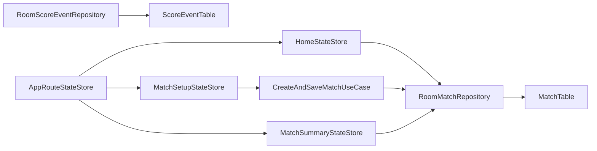

# Requirements

### Overview & Goals
Introduce a cross-platform SQLite-backed store (with schema versioning) for persisted match data, then use it to power a new Home flow.

### Scope
#### In Scope
- Select and standardize on a database library for Android/iOS/Desktop.
- Persist match setup data when `Start Match` is pressed.
- Define initial score persistence model using separate score event storage.
- Add a new Home page as the app entry route.
- Show previously scored matches on Home.
- Add a `New` action on Home to navigate to Match Setup.
- Each stored match row shows inline actions: **Edit**, **Score**, and **Delete**.
- Add a new sprint for DB setup as the next sprint and renumber subsequent sprint docs.

#### Out of Scope
- Full live scoring engine implementation.
- Sync/cloud replication.
- Advanced analytics.

### Functional Requirements
- Database library: **Room + bundled SQLite driver** (`androidx.room` + `androidx.sqlite:sqlite-bundled`) with exported schemas and versioned migrations.
- DB location:
  - Desktop: alongside existing preferences in `~/.kmpscorer/`.
  - Android: app internal files/database location.
  - iOS: app documents directory path.
- Data model structure: **Match table + Score event table** (your chosen architecture).
- `Start Match` must persist the validated match setup before route transition.
- Home list must read from stored matches (not preferences MRU only).
- Home `New` button routes to Match Setup.
- Home row renders inline match actions for that match:
  - `Edit` routes to Match Setup.
  - `Score` routes to scoring entry (temporary fallback: Match Summary until scoring screen exists).
  - `Delete` asks for confirmation and deletes only after confirm.

### Non-Functional Requirements
- Keep expected failures explicit (Arrow-style result types), no exception-driven normal flow.
- Keep domain models platform-neutral in `:domain`.
- Preserve immutable UI state patterns in shared UI/state stores.
- Keep navigation centralized via `ScorerRoute` and `AppRouteStateStore`.

# Technical Design

### Current Implementation
- Routing is centralized in:
  - `shared/src/commonMain/kotlin/cricket/knowledgespike/scorer/navigation/ScorerRoute.kt`
  - `shared/src/commonMain/kotlin/cricket/knowledgespike/scorer/navigation/AppRouteStateStore.kt`
- App shell renders by route in:
  - `shared/src/commonMain/kotlin/cricket/knowledgespike/scorer/App.kt`
- Match setup validation and start gate flow is in:
  - `domain/src/commonMain/kotlin/cricket/knowledgespike/scorer/domain/matchsetup/CreateMatchSetupUseCase.kt`
  - `shared/src/commonMain/kotlin/cricket/knowledgespike/scorer/matchsetup/MatchSetupStateStore.kt`
- Cross-platform file persistence pattern already exists for preferences:
  - `JsonPreferencesRepository`, `OkioPreferencesStorageDataSource`, and platform entry wiring in `MainActivity.kt`, `MainViewController.kt`, `desktopApp/main.kt`.
- Room tooling is already configured in Gradle (`shared/build.gradle.kts`, `libs.versions.toml`) and schema export already exists under `shared/schemas/...`.

### Key Decisions
1. **Database library**: use Room (already configured) with schema versioning and migrations.
2. **Storage structure**: use separate `Match` and `ScoreEvent` persistence tables.
3. **Navigation identity**: introduce persisted match identity for route transitions to summary/scoring paths.
4. **App entry point**: make Home the default route, keeping Match Setup as a dedicated route.
5. **Sprint roadmap update**: insert a DB-focused sprint as the next sprint and renumber downstream sprint docs.

### Proposed Changes
- Add DB contracts/entities/DAOs in shared data/foundation packages (currently present but mostly empty):
  - `shared/src/commonMain/kotlin/cricket/knowledgespike/scorer/data/entity/*`
  - `shared/src/commonMain/kotlin/cricket/knowledgespike/scorer/data/source/*`
  - `shared/src/commonMain/kotlin/cricket/knowledgespike/scorer/foundation/room/*`
- Add domain persistence contracts and errors in `:domain` (repository/use-case style consistent with existing domain patterns).
- Add mapper layer (`toDomain`, `toEntity`) between domain and Room entities.
- Wire platform DB path/builders through existing platform entry points:
  - `androidApp/src/main/kotlin/.../MainActivity.kt`
  - `shared/src/iosMain/kotlin/.../MainViewController.kt`
  - `desktopApp/src/main/kotlin/.../main.kt`
- Extend routing:
  - Add `HomeRoute` (new start route)
  - Add summary route keyed by match identity
  - Keep centralized handling in `ScorerRoute` + `AppRouteStateStore` + `App.kt`
- Add Home feature package (screen/state/store) and summary screen.
- Update `MatchSetupStateStore` so `StartMatchRequested` performs: validate -> persist -> route.

### Data Models / Contracts
- `StoredMatch` (domain): persisted setup + metadata (id, timestamps).
- `ScoreEvent` (domain): append-only score events linked by `matchId`.
- `MatchRepository` (domain contract):
  - `createMatchFromSetup(matchSetup)`
  - `listStoredMatches()`
  - `getMatchSummary(matchId)`
- `ScoreEventRepository` (domain contract):
  - `appendScoreEvent(matchId, event)`
  - `listScoreEvents(matchId)`

### Architecture Diagram

### File Structure
- **Likely modified**
  - `shared/src/commonMain/kotlin/cricket/knowledgespike/scorer/App.kt`
  - `shared/src/commonMain/kotlin/cricket/knowledgespike/scorer/navigation/ScorerRoute.kt`
  - `shared/src/commonMain/kotlin/cricket/knowledgespike/scorer/navigation/AppRouteStateStore.kt`
  - `shared/src/commonMain/kotlin/cricket/knowledgespike/scorer/matchsetup/MatchSetupStateStore.kt`
  - platform entry files for DB path/wiring (`MainActivity.kt`, `MainViewController.kt`, `desktopApp/main.kt`)
  - `docs/SPRINT_PLAN.md`
  - `docs/sprints/SPRINT_*.md` (renumber after inserting DB sprint)
- **Likely new**
  - shared DB entity/DAO/database files in `data/entity`, `data/source`, `foundation/room`
  - Home and summary feature files in `shared/src/commonMain/kotlin/.../feature` (or dedicated package per current naming)
  - domain repository/use-case/error contracts for persisted matches and score events

### Risks
- Existing exported Room schema package name appears legacy; migration baselines may need cleanup.
- Route payload refactor (object payload to id-based payload) can ripple through tests.
- Home list and summary read paths must avoid coupling to preferences MRU data.

# Testing

### Validation Approach
- Extend existing unit-test style used in `domain` and `shared/commonTest`.
- Keep route/store behavior deterministic with state-transition tests.
- Validate DB mapping and persistence logic via repository/data-source tests.

### Key Scenarios
- `Start Match` with valid setup persists a match and routes correctly.
- `Start Match` with invalid setup does not persist and shows validation error.
- Home screen loads persisted match list.
- Home `New` navigates to Match Setup.
- Home rows expose inline actions (`Edit`, `Score`, `Delete`) for each selected `matchId`.
- Home delete action requires explicit confirmation before removal.

### Edge Cases
- Empty database shows empty-home state.
- Persistence write/read failures surface explicit typed errors.
- Migration from initial DB version to next version preserves existing rows.

### Test Changes
- Add domain tests for new repository/use-case contracts.
- Add shared tests for match setup persistence + route transition behavior.
- Add shared/desktop/android UI tests for Home screen states and navigation entry actions.
- Update route-related tests (e.g., `AppRouteStateStoreTest`) for new start route and summary route.

# Delivery Steps

### ✓ Step 1: Establish versioned Room persistence foundation for matches and score events
A versioned SQLite schema exists for `Match` and `ScoreEvent` with repository contracts wired for cross-platform use.
- Add domain-level persistence contracts and typed persistence errors in `:domain` (repository/use-case style aligned with existing `Either` patterns).
- Add Room entities, DAO interfaces, mappers, and database definition under shared `data` / `foundation/room` packages.
- Configure schema versioning and migration path from initial version (`v1`) with exported schema files under `shared/schemas`.
- Reuse platform path conventions so DB files resolve to app-standard locations (desktop alongside preferences, platform-default internal paths on mobile).
- Add unit tests for mappers and repository/data-source read/write behavior including explicit failure mapping.

### ✓ Step 2: Persist match setup on start and transition navigation to persisted match identity
Pressing `Start Match` saves match setup data before navigation and emits routes keyed by stored match identity.
- Update `MatchSetupStateStore` flow from validate-only to validate -> persist -> navigate.
- Introduce/adjust use case(s) to convert `MatchSetup` into stored match records.
- Update `ScorerRoute` and `AppRouteStateStore` to support id-based route transitions needed by history/summary flows.
- Keep business validation authority in `CreateMatchSetupUseCase` and avoid adding domain logic to composables.
- Extend store/route tests for success, validation failure, and persistence failure transitions.

### ✓ Step 3: Add Home and Match Summary routes backed by stored match history
The app opens on a new Home screen listing stored matches, supports `New` navigation to setup, and opens read-only summary on match tap.
- Add Home state/store/screen in shared presentation packages following existing immutable state/event patterns.
- Change app start route in `App.kt` to Home and add route branches for Home/Match Setup/Summary.
- Implement Home list rendering using stored match query from repository, including explicit empty/content/error UI states.
- Implement match row tap routing to a read-only summary screen (as selected), loading data by `matchId`.
- Add/update UI and state tests for Home actions (`New`, item tap) and summary loading behavior.

### ✓ Step 4: Insert database sprint into roadmap and renumber downstream sprint documentation
Sprint docs reflect a new immediate next sprint for DB setup and all subsequent sprints are renamed/renumbered consistently.
- Add a new sprint definition file in `docs/sprints` for database setup + match history/home foundations.
- Renumber existing subsequent sprint files/titles and update references in `docs/SPRINT_PLAN.md`, task docs, and recap links.
- Ensure sprint scope text explicitly separates DB setup (schema/contracts/migrations) from later scoring expansion.
- Update `project_memory.md` with shipped scope, key decisions, gotchas, and covered validation areas once work is completed.

### ✓ Step 5: Add Home row actions for edit, score, and delete with confirmation
Selecting a stored match on Home opens explicit actions and supports safe deletion.
- Update Home state/store/event model so row selection opens an action prompt instead of directly routing.
- Implement `Edit` action to route to Match Setup and `Score` action to route to scoring entry fallback path (currently Match Summary).
- Extend persistence contract/repositories with match deletion support and map failures using `MatchPersistenceError`.
- Implement `Delete` action with confirmation dialog, then refresh Home list after successful deletion.
- Add/update state and UI tests for action selection, delete confirmation/cancel paths, and delete failure handling.

### ✓ Step 6: Replace Home action dialog with inline row actions
Home rows display `Edit`, `Score`, and `Delete` buttons directly without opening a match-action popup.
- Remove the row-tap action prompt flow and use explicit row buttons for `Edit`, `Score`, and `Delete`.
- Keep `Delete` protected by a confirmation dialog before repository deletion.
- Update shared/desktop Home tests for inline button behavior and delete confirm/cancel flow.

### ✓ Step 7: Refactor app navigation to stack-based back behavior with adaptive shell
Navigation is managed as a robust route stack with system back support and desktop-idiomatic shell actions.
- Refactor `AppRouteStateStore` to store a `List<ScorerRoute>` stack and expose `push(route)`, `pop()`, and `resetToHome()` semantics.
- Wire Android/iOS app shell back behavior in `App.kt` with `BackHandler` and a `TopAppBar` back arrow when stack depth is greater than one.
- Use `widthSizeClass` for adaptive shell behavior, rendering desktop-expanded navigation actions (`Home`, `New Match`) via a `NavigationRail` or permanent sidebar.
- Update Home, Match Setup, and Scoring flows to use push/pop/reset methods so route transitions preserve expected stack history.
- Add or update route/store and app UI tests for stack transitions, back actions, and expanded-width navigation behavior.